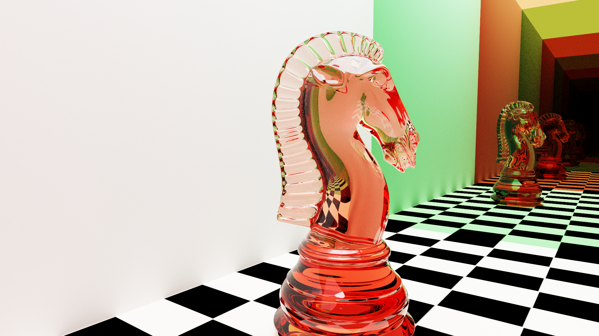
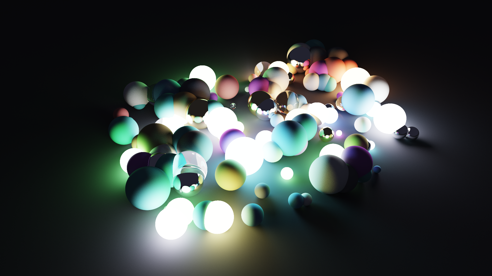
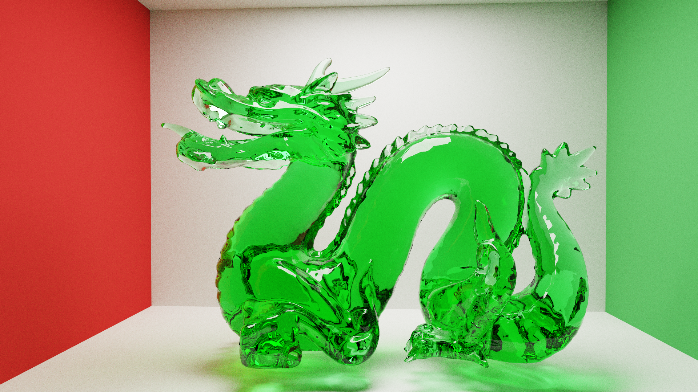
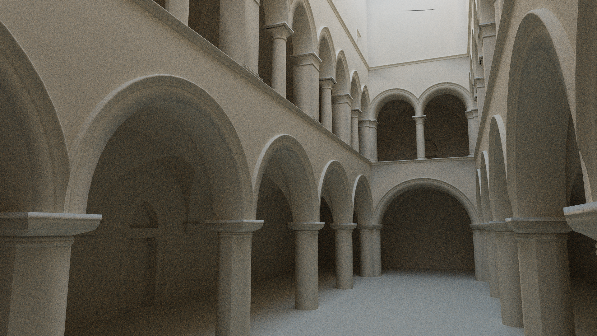
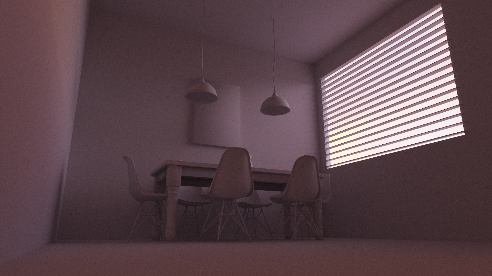
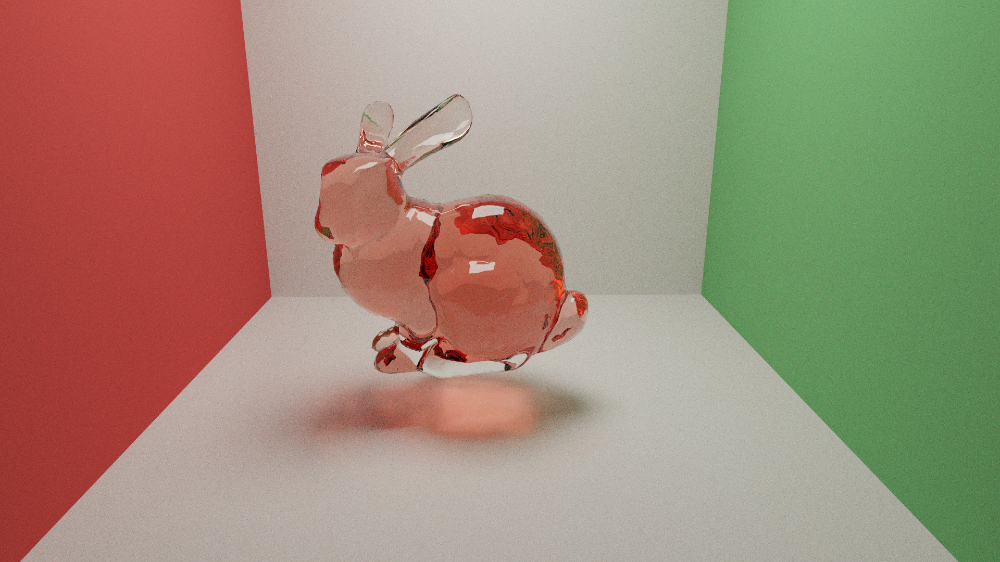
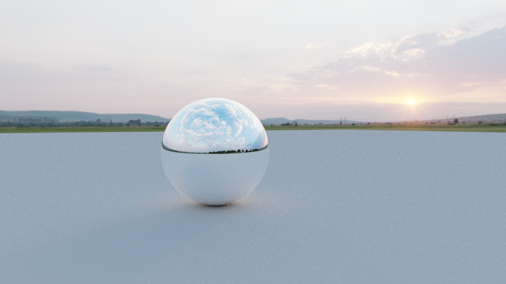
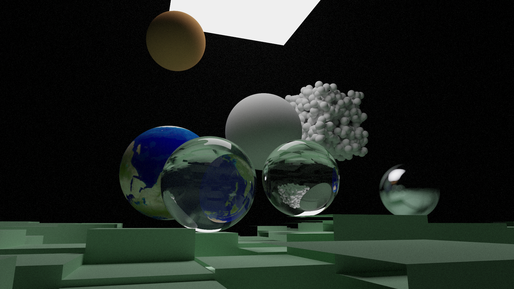

# GPU Path Tracer

A real-time GPU path tracer built from scratch in C++ and GLSL, implementing physically-based light transport with progressive accumulation. Renders run interactively at HD resolution and converge to clean, photorealistic images.

<p align="center">
  
  <br>
  <em>Glass chess knight on a Cornell-box-style infinity stage — showcasing refraction, Beer–Lambert absorption, indirect color bleeding, and recursive reflection.</em>
</p>

---

## Gallery

<table>
  <tr>
    <td width="50%">
      
      <br>
      <em>A field of scattered spheres with mixed materials — matte, chrome, glass, and emissive — lit entirely by the colored lights within the scene itself. Color bleeds between neighboring spheres, reflections pick up surrounding lights.</em>
    </td>
    <td width="50%">
      
      <br>
      <em>Stanford dragon in green tinted glass, ~40k triangles — Beer–Lambert absorption creates depth-dependent color saturation, with caustic spilling onto the floor and color bleed on the surrounding walls.</em>
    </td>
  </tr>
  <tr>
    <td width="50%">
      
      <br>
      <em>The Dabrović Sponza Atrium (~66k triangles) — the classic graphics research benchmark scene. Lit entirely by HDRI sky light pouring through the open roof, with full indirect illumination under the arches.</em>
    </td>
    <td width="50%">
      
      <br>
      <em>Breakfast room (~40k triangles) lit through window blinds — the striped light pattern is a natural consequence of the path tracer integrating light through partial occlusion, with warm indirect bouncing throughout the interior.</em>
    </td>
  </tr>
  <tr>
    <td width="50%">
      
      <br>
      <em>Stanford bunny in red glass — caustic visible on the floor beneath, color bleeding from the Cornell walls.</em>
    </td>
    <td width="50%">
      
      <br>
      <em>Chrome sphere on a matte plane under a sunset HDRI — the entire 360° environment reflected in a single surface, the horizon line cutting the sphere in half. The classic HDRI showcase shot.</em>
    </td>
  </tr>
  <tr>
    <td colspan="2">
      
      <br>
      <em>Materials playground — Earth-textured Lambertian sphere, clear and absorptive glass spheres, mirror finish, fuzzy metal, and a constant-medium volumetric sphere, all in one scene.</em>
    </td>
  </tr>
</table>

---

## Features

### Geometric Primitives
- **Spheres** with analytical intersection
- **Quads** with barycentric interior testing
- **Triangles** via Möller–Trumbore intersection
- **Constant-medium spheres** as a first-class primitive type for volumetric scattering
- **OBJ mesh loading** with automatic vertex-normal computation, deduplicated indexing, and arbitrary 4×4 transform support

### Materials
- **Lambertian** diffuse with cosine-weighted hemisphere sampling
- **Metal** with controllable surface fuzz
- **Dielectric** (glass) with Schlick-approximated Fresnel reflectance
- **Beer–Lambert volumetric absorption** for physically tinted glass
- **Emissive surfaces** for area lighting with controllable intensity
- **Isotropic volumetric scattering** for fog and homogeneous media

### Light Transport
- Iterative path tracing with up to 50 bounces
- **Russian roulette** path termination with unbiased throughput compensation
- **Geometric-normal safety checks** preventing light leaks through low-poly meshes with smooth shading normals
- Separate shading and geometric normal tracking for correct dielectric behavior
- **Woodcock / exponential free-flight sampling** for volumetric media

### Acceleration Structure
- **SAH-built BVH** with binned splits (16 bins per axis, surface-area heuristic cost evaluation)
- **Unified primitive references** — leaves can mix any combination of primitive types
- **Flattened depth-first GPU layout** with iterative stack-based traversal
- **Ordered child visitation** for early pruning during traversal
- Handles scenes with tens of thousands of triangles interactively

### Cameras and Sampling
- Free-flying camera with WASD movement and mouse-look
- Real-time **progressive accumulation** with automatic reset on camera movement
- **Thin-lens defocus blur** with analytical disk sampling
- Configurable field of view via scroll-wheel zoom
- Per-pixel jittered antialiasing using the **PCG hash** for high-quality randomness

### Textures
- **Texture array** support with automatic sRGB-aware resizing
- Texture sampling on quads via barycentric UV interpolation
- Sphere UV mapping using spherical coordinates

### Image-Based Lighting
- **HDR environment maps** (`.hdr` Radiance format) sampled in equirectangular projection
- Controllable environment intensity for exposure balancing
- Firefly clamping for numerically stable convergence
- Toggleable solid-color background mode for studio-style renders

### Tonemapping and Output
- **ACES filmic tonemapper** for photographic highlight rolloff
- Linear-space rendering with display-time gamma correction
- Live exposure control (E + Up / E + Down)
- **PNG export** with tonemapping applied at any sample count

### Engine
- OpenGL 4.6 core profile with GLFW and GLAD
- **Ping-pong framebuffer accumulation** in `GL_RGBA32F` HDR textures
- All scene data uploaded via **SSBOs** (spheres, quads, vertices, indices, BVH nodes, materials, primitive references, medium spheres)
- **Camera UBO** updated per-frame for efficient camera-state synchronization
- Compact GPU struct layouts with `std430` and `std140` alignment respected

---

## Controls

| Key | Action |
| --- | --- |
| `W` / `A` / `S` / `D` | Move camera |
| Mouse | Look around |
| Scroll | Zoom (FOV) |
| `E` + `↑` | Increase exposure |
| `E` + `↓` | Decrease exposure |
| `H` | Toggle HDRI / solid background |
| `P` | Save current frame as PNG |
| `Esc` | Quit |

---

## Build

Requires C++17, OpenGL 4.6, GLFW, GLAD, GLM, and `stb_image` / `stb_image_resize2` / `stb_image_write` (single-header).

```bash
g++ -std=c++17 src/*.cpp -lglfw3 -lopengl32 -lgdi32 -o pathtracer
```

(Adjust linker flags for your platform — the above is for Windows/MinGW.)

---

## References

- Peter Shirley — *Ray Tracing in One Weekend* and *Ray Tracing: The Next Week*
- Matt Pharr, Wenzel Jakob, Greg Humphreys — *Physically Based Rendering* (online edition)
- Krzysztof Narkowicz — ACES filmic tonemapper fit
- Stanford Computer Graphics Laboratory — bunny, dragon meshes
- Marko Dabrović — Sponza Atrium scene

---

## Credits

This project would not exist without freely-licensed libraries 
(GLFW, GLM, GLAD, ImGui, stb), iconic 3D models from Stanford and 
the broader graphics community, and HDR environment maps from 
Poly Haven. Full attributions in [CREDITS.md](./CREDITS.md).

---

*Built as a learning project to understand physically-based light transport on the GPU from first principles. Every component — BVH, intersection, sampling, BRDFs, accumulation pipeline — written from scratch.*
